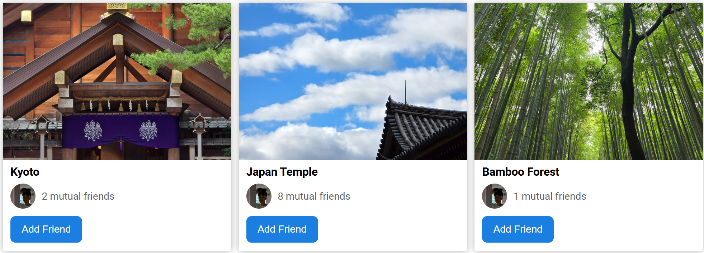

# HTML and CSS Practice

#### Buttons 

[🐲 CSS Code for Buttons](styles/buttons.css)

[🩻 HTML Code for Buttons](buttons.html)

[📍 Link to Website](https://phangchunhoe.github.io/html_css_practice/buttons.html)

#### Grid

[🐲 CSS Code for Grids](styles/grid.css)

[🩻 HTML Code for Grids](grid.html)

[📍 Link to Website](https://phangchunhoe.github.io/html_css_practice/grid.html)

#### Nested Flexbox

[🐲 CSS Code for Buttons](styles/nested_flexbox.css)

[🩻 HTML Code for Buttons](nested_flexbox.html)

[📍 Link to Website](https://phangchunhoe.github.io/html_css_practice/nested_flexbox.html)

#### Grid

[🐲 CSS Code for Grids](styles/grid.css)

[🩻 HTML Code for Grids](grid.html)

[📍 Link to Website](https://phangchunhoe.github.io/html_css_practice/grid.html)

#### Searchbox 

[🩻 HTML Code for Buttons](searchbox_practice.html)

[📍 Link to Website](https://phangchunhoe.github.io/html_css_practice/searchbox.html)

